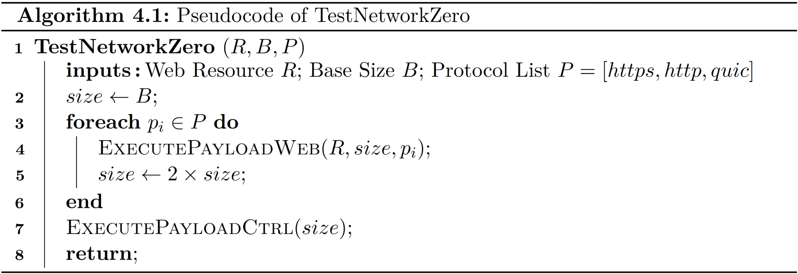

# Zero-Rating, One Big Mess
## Analyzing Differential Pricing Practices of European Mobile Network Operators
This repository contains the result artifacts that were collected during my master's thesis (Topic: "Zero-Rating, One Big Mess: Analyzing Differential Pricing Practices of European Mobile Network Operators") at [TU Vienna](https://www.tuwien.at/en/).

### Repository Content
* README (this file): overview and brief recap of measurement methodology
* [Thesis](Thesis.pdf): final version of the master's thesis
* [Measurement Artifacts](https://mobileatlas.eu/thesis/results.zip): packed measurement results (hosted externally because of github size constraints)

### Related Repositories
* [mobile-atlas](https://github.com/sbaresearch/mobile-atlas): contains the source code (including test metrics) that was used to generate the results of the thesis
* [pySIM](https://github.com/GGegenhuber/pysim): forked version of pySIM that is used within the [mobile-atlas](https://github.com/sbaresearch/mobile-atlas) repository

## Test Methodology
To conduct our measurements we used the [MobileAtlas measurement platform](https://mobileatlas.eu/).

For tests on differential pricing and, more specifically, zero-rating, we need to know whether specific traffic is deducted from the available credit units or funds.
To cope with different update latency of consumed units and to enable running multiple payloads without in-between waiting for the billing records to update, we use binary exponents, i.e., every payload uses traffic amounts selected from baseunit &times; 2testid.
For example, the first payload might use 1 MB, the second 2 MB, the third 4 MB, and the fourth 8 MB.
When the final traffic billing arrives (which in our case is a control payload that is always billed), we can unambiguously deduct which payloads were counted towards the customer's bill.

To reveal potential metrics that are used for classification by a certain provider, we designed three different tests.
Because most web services nowadays are built upon HTTPS communication, our tests focus on web resources as well.
Thereby, basically any service that uses HTTPS communication can be tested by providing an appropriate web endpoint to the test script.
Because we also want to take a peek into the past and into the future and many web servers offer multiple protocols to serve their content anyway, MobileAtlas implements support for HTTP, HTTPS, and HTTP3/QUIC.

To identify endpoints that might be of particular interest (i.e., endpoints that correspond to a zero-rated app), we usually collected a traffic dump of the target application.

### Validate Zero-Rating ([TestNetworkZero](https://github.com/sbaresearch/mobile-atlas/blob/38ee0c8062b17da093f9cecd796d245245e410cf/mobileatlas/probe/measurement/test/test_network_zero_web.py#L14))

    

This test is responsible for validating that the provided web resource is actually zero-rated by the provider.
Furthermore, the test configuration allows providing a list of protocols that are tested during the experiment.
Per default *HTTPS*, *HTTP* and *HTTP3/QUIC* are used.
As Algorithm 4.1 shows, the list of protocols is sequentially processed with increasing payload size.
When executing the payload for a concrete protocol, the test repeatedly requests the resource using the corresponding protocol. For repeated requests, the payload implementation ensures that the DNS query is only issued once.
Finally, the test generates control traffic to a third party that is not part of any zero-rating program and therefore normally billed.
As previously described, the test terminates as soon as the control traffic is recognized.
The Figure above gives an overview of the involved actors and the traffic flow when the test is executed for an application with the hostname *application.com*.

### Detect Host-Based Zero-Rating ([TestNetworkZeroCheckSni](https://github.com/sbaresearch/mobile-atlas/blob/38ee0c8062b17da093f9cecd796d245245e410cf/mobileatlas/probe/measurement/test/test_network_zero_web.py#L63))

This test retrieves the IP address of the server that holds the provided web resource.
It then automatically launches an EC2-instance and forwards the corresponding ports for the protocols that should be tested (e.g., TCP80 and TCP443 for HTTP and HTTPS and UDP443 for QUIC).
Thus, when a TCP connection to the freshly spawned EC2 server is initiated on port 80, the connection is forwarded to the original web server. Thereby, the same content is served, although the data packet that is processed by the provider is headed to a different IP address.
When executing the payload for a certain protocol, the measurement environment pins the hostname of the original web resource to the IP address of the EC2 instance, resulting in a spoofed IP address during DNS lookup. Therefore, the measurement is also conducted against a third-party IP address (i.e., against the EC2 server).
The Figure above gives an overview of the involved actors and the traffic flow during this test. When the data packets are passing the classifier, the hostname within the packets matches the one from the application. However, the IP address of the packets does not match the address of the application's web server because the packets are headed to the EC2 instance. Furthermore, the provider does not know about the port forwarding because this happens behind closed doors on the EC2 instance. However, the content of the data packets is equal to the previous test because the EC2 instance acts as a proxy to the actual application's web server.

### Detect IP-Based Zero-Rating ([TestNetworkZeroCheckIp](https://github.com/sbaresearch/mobile-atlas/blob/38ee0c8062b17da093f9cecd796d245245e410cf/mobileatlas/probe/measurement/test/test_network_zero_web.py#L92))

While no external server is needed for this test, the actual hostname that is sent within the target protocol is replaced. Again we get the required behavior by spoofing DNS responses.
The hostname of the original web resource is replaced by *example.com*, and when requesting the IP address of the target resource, the original IP address is returned.
Therefore, the program connects to the right IP address but sends a different hostname (e.g., for the Host-/SNI header) at the protocol layer.
The Figure above gives an overview of the involved actors and the traffic flow during this test.
Although the packets are sent to the real application's web server, they do not contain the actual hostname because it was previously exchanged with a dummy value (*example.com*).

License
---------------------------------------

This work is licensed under GPLv3.

