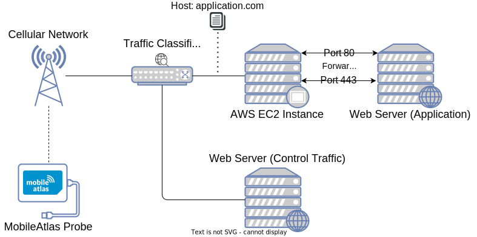

# Zero-Rating, One Big Mess: Analyzing Differential Pricing Practices of European Mobile Network Operators
This repository contains the result artifacts that were collected during my master's thesis at TU Vienna.

### Related Repositories
* [mobile-atlas](https://github.com/sbaresearch/mobile-atlas): contains the source code (including test metrics) that was used to generate the results of the thesis
* [pySIM](https://github.com/GGegenhuber/pysim): forked version of pySIM that is used within the [mobile-atlas](https://github.com/sbaresearch/mobile-atlas) repository

## Test Methodology

### Validate Zero-Rating (TestNetworkZero)

    

This test is responsible for validating that the provided web resource is actually zero-rated by the provider.
Furthermore, the test configuration allows providing a list of protocols that are tested during the experiment.
Per default _HTTPS_, *HTTP* and *HTTP3/QUIC* are used.
As Algorithm~\ref{alg:testnetworkzero} shows, the list of protocols is sequentially processed with increasing payload size.
When executing the payload for a concrete protocol, the test repeatedly requests the resource using the corresponding protocol. For repeated requests, the payload implementation ensures that the DNS query is only issued once.
Finally, the test generates control traffic to a third party that is not part of any zero-rating program and therefore normally billed.
As previously described, the test terminates as soon as the control traffic is recognized.
Figure~\ref{fig:TestNetworkZero} gives an overview of the involved actors and the traffic flow when the test is executed for an application with the hostname *application.com*.

### Detect Host-Based Zero-Rating (TestNetworkZeroCheckSni)

    

This test retrieves the IP address of the server that holds the provided web resource.
It then automatically launches an EC2-instance and forwards the corresponding ports for the protocols that should be tested (e.g., TCP80 and TCP443 for HTTP and HTTPS and UDP443 for QUIC).
Thus, when a TCP connection to the freshly spawned EC2 server is initiated on port 80, the connection is forwarded to the original web server. Thereby, the same content is served, although the data packet that is processed by the provider is headed to a different IP address.
When executing the payload for a certain protocol, the measurement environment pins the hostname of the original web resource to the IP address of the EC2 instance, resulting in a spoofed IP address during DNS lookup. Therefore, the measurement is also conducted against a third-party IP address (i.e., against the EC2 server).
Figure~\ref{fig:TestNetworkZeroCheckSni} gives an overview of the involved actors and the traffic flow during this test. When the data packets are passing the classifier, the hostname within the packets matches the one from the application. However, the IP address of the packets does not match the address of the application's web server because the packets are headed to the EC2 instance. Furthermore, the provider does not know about the port forwarding because this happens behind closed doors on the EC2 instance. However, the content of the data packets is equal to the previous test because the EC2 instance acts as a proxy to the actual application's web server.

### Detect IP-Based Zero-Rating (TestNetworkZeroCheckIp)

    

While no external server is needed for this test, the actual hostname that is sent within the target protocol is replaced. Again we get the required behavior by spoofing DNS responses.
The hostname of the original web resource is replaced by *example.com*, and when requesting the IP address of the target resource, the original IP address is returned.
Therefore, the program connects to the right IP address but sends a different hostname (e.g., for the Host-/SNI header) at the protocol layer.
Figure~\ref{fig:TestNetworkZeroCheckIp} gives an overview of the involved actors and the traffic flow during this test.
Although the packets are sent to the real application's web server, they do not contain the actual hostname because it was previously exchanged with a dummy value (*example.com*).

License
---------------------------------------

This work is licensed under GPLv3.

